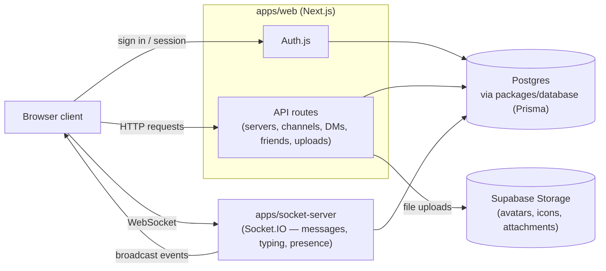

# Discord Clone

A Discord-inspired chat app: servers and channels with role-based
permissions, realtime messaging and presence, direct messages, friends, and
image uploads (avatars, server icons, message attachments).

## Architecture

npm workspaces monorepo:

- `apps/web` — Next.js app (UI, API routes, Auth.js).
- `apps/socket-server` — Express + Socket.IO server (not yet wired up to any
  realtime feature; scaffolded for an upcoming phase).
- `packages/database` — Prisma schema, client, and migrations.
- `packages/permissions` — Shared server/channel role-permission logic.

## How it works

Requests either go through the Next.js API for standard CRUD (auth, servers,
channels, friends, uploads) or over a WebSocket to the socket server for
realtime events (new messages, typing indicators, presence). Both talk to the
same Postgres database through Prisma, and permission checks (`packages/permissions`)
gate who can do what in a server/channel.

## Setup

1. `npm install`
2. `docker compose up -d` — starts Postgres. The default `POSTGRES_DB` is
   `discord_clone_dev`; a `discord_clone_test` database is also created
   automatically via the init script, but only on a fresh volume (see
   `docker/init-test-db.sql` for the manual fallback if you already had a
   Postgres volume before this database was added).
3. Copy `packages/database/.env.example` to `packages/database/.env` (already
   points at the local Docker Postgres by default).
4. Copy `apps/web/.env.example` to `apps/web/.env.local` (also points at the
   local Docker Postgres by default; set `NEXTAUTH_SECRET` to any value for
   local dev, e.g. `openssl rand -base64 32`).
5. `npm run migrate:dev --workspace=packages/database` — applies migrations
   to the dev database.
6. `npm run migrate:test --workspace=packages/database` — applies migrations
   to the test database (needed once before running tests).
7. `npm run dev:web` and/or `npm run dev:socket` to run the apps.
8. `npm test` to run all test suites.

Google OAuth is optional — leave `GOOGLE_CLIENT_ID` / `GOOGLE_CLIENT_SECRET`
blank in `apps/web/.env.local` to skip it. Credentials (email/password) auth
works without it.
